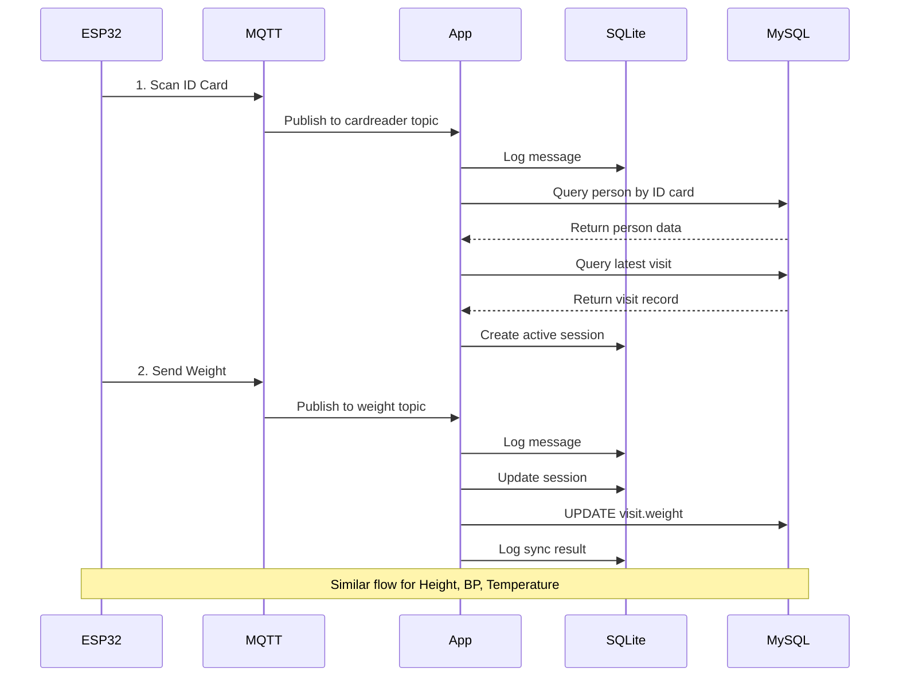

# Medical Data Collector

> Desktop application for collecting medical data from ESP32 devices via MQTT and storing to MySQL database.


---

## 📋 Overview

Medical Data Collector เป็นแอปพลิเคชัน Desktop ที่รันเบื้องหลังเพื่อรับข้อมูลชีวสัญญาณจากอุปกรณ์ ESP32 ผ่าน MQTT Protocol และบันทึกลงฐานข้อมูล MySQL ของคลินิก

### Key Features

- 🔄 **MQTT Broker ในตัว** - ไม่ต้องติดตั้ง MQTT broker แยก
- 💾 **UPDATE-only Database** - อัพเดทข้อมูลในตาราง visit เท่านั้น (ไม่สร้าง record ใหม่)
- 📝 **Comprehensive Logging** - เก็บ log ทุก transaction ใน SQLite + Text files
- 🖥️ **User-Friendly UI** - Dashboard แสดงข้อมูล real-time
- ⚙️ **Easy Configuration** - ตั้งค่าผ่าน UI ได้ง่าย
- 🔐 **Secure** - Encrypted configuration storage
- 🔄 **Auto-Update** - อัพเดทอัตโนมัติ
- 🌍 **Cross-Platform** - รองรับ Windows, macOS, Linux

---

## 🏗️ Architecture

```
┌─────────────┐          ┌──────────────────┐         ┌─────────────┐
│   ESP32     │  MQTT    │       App        │  MySQL  │   Remote    │
│  Devices    │─────────>│                  │────────>│  Database   │
└─────────────┘          └──────────────────┘         └─────────────┘
  • Card Reader              • MQTT Broker                • person
  • Weight Scale             • Data Processor             • visit
  • Height Meter             • Update MySQL
  • BP Monitor               • Logging (SQLite + Text)
  • Thermometer
  • Pulse
```

---

## 🚀 Quick Start

### For Users (Installation)

1. **Download Installer**
   - Windows: `Medical-Data-Collector-Setup-1.0.0.exe`
   - macOS: `Medical-Data-Collector-1.0.0.dmg`
   - Linux: `Medical-Data-Collector-1.0.0.AppImage`

2. **Install**
   - Run installer and follow instructions
   - App will auto-start after installation

3. **Configure**
   - Open Settings
   - Enter MySQL database credentials
   - Save and test connection

4. **Start Using**
   - App runs in background (system tray)
   - Configure ESP32 devices with MQTT credentials
   - Start collecting data!

### For Developers

See [QUICK_START_GUIDE.md](./QUICK_START_GUIDE.md) for detailed development setup.

```bash
# Clone repository
git clone https://github.com/your-username/medical-data-collector.git
cd medical-data-collector

# Install dependencies
npm install

# Start development
npm run dev

# Build
npm run build

# Create installer
npm run dist
```

---

## 📁 Documentation

| Document | Description |
|----------|-------------|
| [PROJECT_PLAN.md](./PROJECT_PLAN.md) | Complete project plan, architecture, and implementation guide |
| [QUICK_START_GUIDE.md](./QUICK_START_GUIDE.md) | Quick setup guide for developers |
| [DATABASE_SCHEMA.md](./DATABASE_SCHEMA.md) | Database schema and SQL queries reference |
| [ESP32_INTEGRATION_GUIDE.md](./ESP32_INTEGRATION_GUIDE.md) | Guide for ESP32 device integration |

---

## 🔧 Technology Stack

### Core
- **Electron** 28.0.0 - Desktop application framework
- **Next.js** 14.1.0 - React framework for UI
- **TypeScript** 5.3.0 - Type safety

### MQTT
- **Aedes** 0.50.0 - Embedded MQTT broker
- **MQTT.js** 5.3.0 - MQTT client

### Database
- **MySQL2** 3.6.0 - MySQL client for customer database
- **better-sqlite3** 9.2.0 - SQLite for local logging

### UI
- **Tailwind CSS** 3.4.0 - Styling
- **shadcn/ui** - Component library
- **Lucide React** - Icons

### Build & Distribution
- **electron-builder** 24.9.0 - Build installers
- **electron-updater** 6.1.0 - Auto-update

---

## 📊 Data Flow

### Complete Workflow



---

## 🗄️ Database Structure

### Remote MySQL (Customer Database)

**Tables:**
- `person` - Patient information (READ only)
- `visit` - Visit records (READ + UPDATE)

**Application Operations:**
- ✅ SELECT from person
- ✅ SELECT from visit
- ✅ UPDATE visit (vital signs only)
- ❌ No INSERT or DELETE

### Local SQLite (Application Database)

**Tables:**
- `app_config` - Encrypted configuration
- `mqtt_log` - All MQTT messages
- `active_sessions` - Current data collection sessions
- `sync_history` - MySQL update history

---

## 📡 MQTT Protocol

### Topics

```
clinic/{pcucode}/device/{device_type}/data
```

### Device Types

| Device | Topic | Data |
|--------|-------|------|
| Card Reader | `clinic/09584/device/cardreader/data` | ID card number |
| Pulse Oximeter / Heart Rate | `clinic/09584/device/pulse/data` | Pulse (bpm) |
| Weight Scale | `clinic/09584/device/weight/data` | Weight in kg |
| Height Meter | `clinic/09584/device/height/data` | Height in cm |
| BP Monitor | `clinic/09584/device/bp/data` | Blood pressure (120/80) |
| Thermometer | `clinic/09584/device/temp/data` | Temperature in °C |

**Card Reader Reset:**
- หากส่ง cardreader ที่ `idcard` ว่าง ระบบจะล้าง Active Session และรอข้อมูลใหม่

### Message Format

```json
{
  "device_type": "weight",
  "idcard": "7012345678901",
  "weight": 65.5,
  "timestamp": "2024-02-02T10:30:15.000Z"
}
```

---

## 🖥️ User Interface

### Dashboard
- Real-time data display
- Active session monitoring
- MQTT & MySQL status
- Recent activity log

### Settings
- Database configuration
- MQTT configuration
- Application settings

### History
- View past visits
- Filter by date/ID card
- Export to Excel

### System Tray
- Background operation
- Quick access to features
- Status indicators

---

## 🔐 Security

- ✅ Encrypted configuration storage (electron-store)
- ✅ MQTT authentication (username/password)
- ✅ MySQL user with minimal permissions
- ✅ No sensitive data in logs
- ✅ Secure IPC communication

---

## 📝 Logging

### Text Files (Daily Rotation)
```
logs/
├── 2024-02-01.log
├── 2024-02-02.log
└── 2024-02-03.log
```

### SQLite Database
- All MQTT messages
- All MySQL updates
- Session history
- Error logs

**Retention**: 30 days (configurable)

---

## 🚨 Error Handling

### MySQL Connection Lost
- ✅ Queue updates in memory
- ✅ Auto-retry with exponential backoff
- ✅ Persist queue to SQLite
- ✅ Resume when connection restored

### Invalid Data
- ✅ Validate with Zod schemas
- ✅ Log validation errors
- ✅ Skip invalid messages
- ✅ Continue processing

### Session Timeout
- ✅ Auto-cleanup after 10 minutes (configurable)
- ✅ Log timeout events
- ✅ Notify via UI

---

## 📦 Build & Distribution

### Development
```bash
npm run dev          # Start dev server with hot reload
```

### Production Build
```bash
npm run build        # Build Next.js + Electron
npm run dist         # Create installer for current platform
npm run dist:all     # Create installers for all platforms
```

### Platform-Specific
```bash
npm run dist:win     # Windows (NSIS)
npm run dist:mac     # macOS (DMG)
npm run dist:linux   # Linux (AppImage + DEB)
```

---

## 🔄 Auto-Update

- Checks for updates on startup
- Background check every 6 hours
- Downloads silently
- Notifies user when ready
- Installs on next restart

**Update Server**: GitHub Releases (configurable)

---

## 🧪 Testing

### Unit Tests
```bash
npm run test
```

### Integration Tests
```bash
npm run test:integration
```

### E2E Tests
```bash
npm run test:e2e
```

### Manual Testing
See testing checklist in PROJECT_PLAN.md

---

## 🐛 Troubleshooting

### Common Issues

**MQTT Broker won't start**
- Check if port 1883 is available
- Try changing port in Settings
- Check firewall rules

**Cannot connect to MySQL**
- Verify server is running
- Check IP address and credentials
- Test with MySQL Workbench
- Check firewall rules

**ESP32 not connecting**
- Verify same network
- Check MQTT credentials
- Use MQTT Explorer to debug

**Data not updating**
- Check sync_history table
- Review logs folder
- Verify visit record exists

See full troubleshooting guide in PROJECT_PLAN.md

---

## 📞 Support

### For Users
- Installation issues: support@clinic.com
- Technical support: tech@clinic.com
- Phone: 02-XXX-XXXX

### For Developers
- GitHub Issues: [repo-url]
- Documentation: See docs/ folder
- Email: dev@clinic.com

---

## 🛣️ Roadmap

### Version 1.1 (Q2 2024)
- [ ] Multi-language support (Thai/English)
- [ ] Advanced filtering in History
- [ ] Custom reports
- [ ] Email notifications

### Version 2.0 (Q3 2024)
- [ ] Cloud backup
- [ ] Mobile app for monitoring
- [ ] Analytics dashboard
- [ ] Multi-clinic support

---

## 📄 License

Proprietary - Medical Data Collector  
Copyright © 2024 [Your Company Name]  
All rights reserved.

This software is proprietary and confidential. Unauthorized copying, modification, distribution, or use of this software, via any medium, is strictly prohibited.

---

## 👥 Contributors

- **Lead Developer**: [Your Name]
- **System Architect**: [Your Name]
- **UI/UX Designer**: [Designer Name]
- **QA Engineer**: [QA Name]

---

## 🙏 Acknowledgments

- Electron Team - Amazing desktop framework
- Next.js Team - Excellent React framework
- Aedes Team - Lightweight MQTT broker
- All open source contributors

---

## 📊 Project Status

- **Current Version**: 1.0.0
- **Status**: ✅ Production Ready
- **Last Updated**: 2024-02-02
- **Next Release**: v1.1.0 (Q2 2024)

---

## 📚 Additional Resources

- [Electron Documentation](https://www.electronjs.org/docs)
- [Next.js Documentation](https://nextjs.org/docs)
- [MQTT Protocol](https://mqtt.org/)
- [MySQL Documentation](https://dev.mysql.com/doc/)

---

## 🔗 Links

- **Repository**: https://github.com/your-username/medical-data-collector
- **Issues**: https://github.com/your-username/medical-data-collector/issues
- **Releases**: https://github.com/your-username/medical-data-collector/releases
- **Documentation**: https://github.com/your-username/medical-data-collector/tree/main/docs

---

**Made with ❤️ for Healthcare Professionals**
